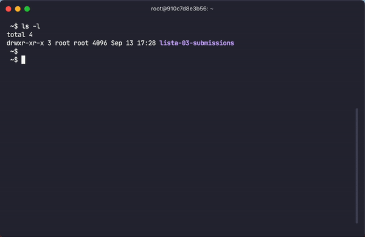

<picture>
  <source media="(prefers-color-scheme: dark)" srcset="images/logo-dark.png">
  
</picture>

**claro** is a [GitHub Classroom](https://classroom.github.com) CLI for teachers

# Overview

**claro** (**cla**ss**ro**om) is a [CLI](https://clig.dev) tool designed to simplify the grading process for educators using [GitHub Classroom](classroom.github.com), especially in cases where manual grading is necessary and autograding is not an option. **claro** is an alternative to the [GitHub Classroom Assistant](https://classroom.github.com/assistant) and [Github CLI](https://cli.github.com), which currently lacks bulk processing features for grading. With claro, you can efficiently clone all student repositories, grade them, and push the grades back.

**claro** offers:
- Bulk cloning and pushing of student assignment repositories
- Automatic generation of a Markdown grading template (one file per repository)
- Customization options (commit messages, grade sheet titles, grading files, etc.)
- Integration with [Github Personal Access Token](https://docs.github.com/en/authentication/keeping-your-account-and-data-secure/creating-a-personal-access-token) via your operating system’s keyring (e.g., macOS Keychain, Gnome Keyring)

## Straight workflow

1. Clone all repositories from a Github Classroom assignment
   - Example: `claro clone`

    

2. Grade each student's work and write down the feedback in the respective Markdown file
   - Tip: Use your best Markdown editor for this

    

3. Upload student grades to GitHub
   - Example: `claro push <directory-with-student-submissions>`

    

## Additional commands

### Pulls the latest changes from all student repositories

- Example: `claro pull <directory-with-student-submissions>`

### Add a GitHub Personal Access Token to the operating system keyring

- Example: `claro token add`

### Remove a GitHub Personal Access Token from the operating system keyring

- Example: `claro token del`

### Customize commit message, grading filename, grading string

You can customize the commit message, grading filename, and grading string using the `config` command. The new values will be stored in the **claro**'s config file (default `$HOME/.config/claro/config.env`).

The **claro** default strings are:

- **Grading filename:** `GRADING.md`
  -  It will be created and pushed to student repository
- **Grade string:** `Grade: `
  - It will be inside grading file 
- **Commit message:** `This project has been graded. The file containing the grade is located in the root directory.`
  - It is the commit message
- **Grade sheet title** `Feedback`
  - It will be inside grading file as title 1 (# Feedback)

## GitHub Personal Access Token

**claro** uses Git to clone, pull, and push repositories. To streamline this process, **claro** will prompt you for your GitHub credentials each time you perform these actions. This can be tedious, especially when handling multiple repositories. To avoid repeated prompts, **claro** will check if [Git's credential storage](https://git-scm.com/book/en/v2/Git-Tools-Credential-Storage) is configured on its first run. If not, it will set up Git to store credentials in cache (e.g., `git config --global credential.helper cache`). You will be asked for your GitHub Personal Access Token only once, and it will remain cached until the cache expires.

**claro** also requires a [GitHub Personal Access Token](https://docs.github.com/en/authentication/keeping-your-account-and-data-secure/creating-a-personal-access-token) to access the [Github's Classroom API](https://docs.github.com/en/rest/classroom?apiVersion=2022-11-28) when cloning repositories. This token is not stored in Git's credential storage, so it is best kept in your operating system's keyring. You can store it using the token add command. Once saved, you won’t need to re-enter it each time you use **claro**. For instructions on how to use your operating system's keyring, [see this guide](https://git-scm.com/doc/credential-helpers).